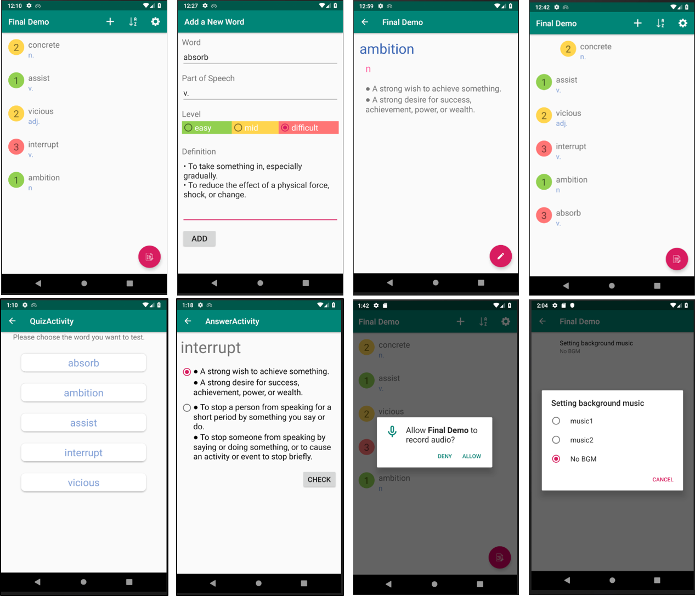

# Vocabulary List

## 功能簡介

此應用程式為一個簡易的英文單字卡，包括以下幾點功能：

* **新增、刪除、更新單字**：可讓使用者依據自己的需求來調整單字卡的內容。
* **測驗區**：讓使用者能針對某一個單字，檢測自我的學習成果。
* **播放背景音樂**：取得音樂播放權限以後，使用者能自由選擇要播放哪首系統提供的背景音樂，或是關閉背景音樂。
* **排序單字**：能根據字母順序檢視單字清單。

> 開發工具：**Android Studio**
> 
> 開發語言：**Java**

## 成果展示

